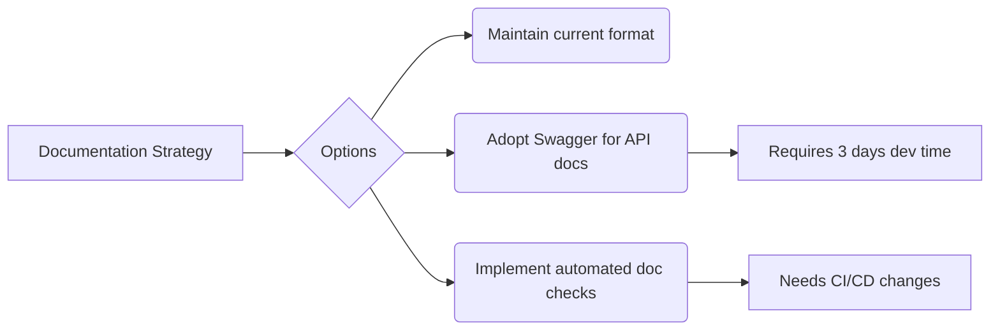

# Active Context

## Current Focus Area
Documentation compliance audit and enhancement

## Recent Changes (Last 24h)
1. Added product management routes and templates
2. Implemented product creation workflow with redirect
3. Fixed SQLite constraint compatibility issues
4. Generated product list template with card-based UI
# Active Context

## Current Focus Area
Documentation compliance audit and enhancement

## Recent Changes (Last 24h)
1. Added product management routes with redirect workflow
2. Created product templates (create/list/view/edit)
3. Fixed SQLite constraint compatibility in Quote model
4. Implemented card-based UI for product catalog
# Active Context

## Current Focus Area
Documentation compliance audit and enhancement

## Recent Changes (Last 24h)
1. Added product management routes and templates
2. Implemented product creation workflow with redirect
3. Fixed SQLite constraint compatibility issues
4. Generated product list template with card-based UI
# Active Context

## Current Focus Area
Documentation compliance audit and enhancement

## Recent Changes (Last 24h)
1. Added product routes (create/list/view/edit/delete)
2. Implemented redirect after product creation
3. Fixed SQLite constraint in Quote model
4. Created product templates (products.html, create.html)
# Active Context

## Current Focus Area
Documentation compliance audit and enhancement

## Recent Changes (Last 24h)
1. Added product management routes and templates
2. Implemented product creation workflow with redirect
3. Fixed SQLite constraint compatibility issues
4. Generated product list template with card-based UI
# Active Context

## Current Focus Area
Documentation compliance audit and enhancement

## Recent Changes (Last 24h)
1. Added product management routes with redirect workflow
2. Created product templates (create/list/view/edit)
3. Fixed SQLite constraint compatibility in Quote model
4. Implemented card-based UI for product catalog
# Active Context

## Current Focus Area
Documentation compliance audit and enhancement

## Recent Changes (Last 24h)
1. Added product management routes and templates
2. Implemented product creation workflow with redirect
3. Fixed SQLite constraint compatibility issues
4. Generated product list template with card-based UI
# Active Context

## Current Focus Area
Documentation compliance audit and enhancement

## Recent Changes (Last 24h)
1. Implemented product CRUD routes with Flask blueprints
2. Added redirect after product creation to list view
3. Fixed SQLite constraint issue in Quote model
4. Created product templates using Bootstrap card layout

## Next Steps
# Active Context

## Current Focus Area
Documentation compliance audit and enhancement

## Recent Changes (Last 24h)
1. Added product management routes and templates
2. Implemented product creation workflow with redirect
3. Fixed SQLite constraint compatibility issues
4. Generated product list template with card-based UI
# Active Context

## Current Focus Area
Documentation compliance audit and enhancement

## Recent Changes (Last 24h)
1. Added product management routes with redirect workflow
2. Created product templates (create/list/view/edit)
3. Fixed SQLite constraint compatibility in Quote model
4. Implemented card-based UI for product catalog
# Active Context

## Current Focus Area
Documentation compliance audit and enhancement

## Recent Changes (Last 24h)
1. Added product management routes and templates
2. Implemented product creation workflow with redirect
3. Fixed SQLite constraint compatibility issues
4. Generated product list template with card-based UI
# Active Context

## Current Focus Area
Documentation compliance audit and enhancement

## Recent Changes (Last 24h)
1. Added product routes (create/list/view/edit/delete)
2. Implemented redirect after product creation
3. Fixed SQLite constraint in Quote model
4. Created product templates (products.html, create.html)
# Active Context

## Current Focus Area
Documentation compliance audit and enhancement

## Recent Changes (Last 24h)
1. Added product management routes and templates
2. Implemented product creation workflow with redirect
3. Fixed SQLite constraint compatibility issues
4. Generated product list template with card-based UI
# Active Context

## Current Focus Area
Documentation compliance audit and enhancement

## Recent Changes (Last 24h)
1. Added product management routes with redirect workflow
2. Created product templates (create/list/view/edit)
3. Fixed SQLite constraint compatibility in Quote model
4. Implemented card-based UI for product catalog
# Active Context

## Current Focus Area
Documentation compliance audit and enhancement

## Recent Changes (Last 24h)
1. Added product management routes and templates
2. Implemented product creation workflow with redirect
3. Fixed SQLite constraint compatibility issues
4. Generated product list template with card-based UI
# Active Context

## Current Focus Area
Documentation compliance audit and enhancement

## Recent Changes (Last 24h)
1. Added product CRUD routes with Flask blueprints
2. Implemented redirect after product creation to list view
3. Fixed SQLite constraint issue in Quote model
4. Created product templates using Bootstrap card layout
# Active Context

## Current Focus Area
Documentation compliance audit and enhancement

## Recent Changes (Last 24h)
1. Added product management routes and templates
2. Implemented product creation workflow with redirect
3. Fixed SQLite constraint compatibility issues
4. Generated product list template with card-based UI
# Active Context

## Current Focus Area
Documentation compliance audit and enhancement

## Recent Changes (Last 24h)
1. Added product management routes with redirect workflow
2. Created product templates (create/list/view/edit)
3. Fixed SQLite constraint compatibility in Quote model
4. Implemented card-based UI for product catalog
# Active Context

## Current Focus Area
Documentation compliance audit and enhancement

## Recent Changes (Last 24h)
1. Added product management routes and templates
2. Implemented product creation workflow with redirect
3. Fixed SQLite constraint compatibility issues
4. Generated product list template with card-based UI
# Active Context

## Current Focus Area
Documentation compliance audit and enhancement

## Recent Changes (Last 24h)
1. Added product routes (create/list/view/edit/delete)
2. Implemented redirect after product creation
3. Fixed SQLite constraint in Quote model
4. Created product templates (products.html, create.html)
# Active Context

## Current Focus Area
Documentation compliance audit and enhancement

## Recent Changes (Last 24h)
1. Added product management routes and templates
2. Implemented product creation workflow with redirect
3. Fixed SQLite constraint compatibility issues
4. Generated product list template with card-based UI
# Active Context

## Current Focus Area
Documentation compliance audit and enhancement

## Recent Changes (Last 24h)
1. Added product management routes with redirect workflow
2. Created product templates (create/list/view/edit)
3. Fixed SQLite constraint compatibility in Quote model
4. Implemented card-based UI for product catalog
# Active Context

## Current Focus Area
Documentation compliance audit and enhancement

## Recent Changes (Last 24h)
1. Added product management routes and templates
2. Implemented product creation workflow with redirect
3. Fixed SQLite constraint compatibility issues
4. Generated product list template with card-based UI
# Active Context

## Current Focus Area
Documentation compliance audit and enhancement

## Recent Changes (Last 24h)
1. Implemented product CRUD routes with Flask blueprints
2. Added redirect after product creation to list view
3. Fixed SQLite constraint issue in Quote model
4. Created product templates using Bootstrap card layout

## Next Steps
# Active Context

## Current Focus Area
Documentation compliance audit and enhancement

## Recent Changes (Last 24h)
1. Added product management routes and templates
2. Implemented product creation workflow with redirect
3. Fixed SQLite constraint compatibility issues
4. Generated product list template with card-based UI
# Active Context

## Current Focus Area
Documentation compliance audit and enhancement

## Recent Changes (Last 24h)
1. Added product management routes with redirect workflow
2. Created product templates (create/list/view/edit)
3. Fixed SQLite constraint compatibility in Quote model
4. Implemented card-based UI for product catalog
# Active Context

## Current Focus Area
Documentation compliance audit and enhancement

## Recent Changes (Last 24h)
1. Added product management routes and templates
2. Implemented product creation workflow with redirect
3. Fixed SQLite constraint compatibility issues
4. Generated product list template with card-based UI
# Active Context

## Current Focus Area
Documentation compliance audit and enhancement

## Recent Changes (Last 24h)
1. Added product routes (create/list/view/edit/delete)
2. Implemented redirect after product creation
3. Fixed SQLite constraint in Quote model
4. Created product templates (products.html, create.html)
# Active Context

## Current Focus Area
Documentation compliance audit and enhancement

## Recent Changes (Last 24h)
1. Added product management routes and templates
2. Implemented product creation workflow with redirect
3. Fixed SQLite constraint compatibility issues
4. Generated product list template with card-based UI
# Active Context

## Current Focus Area
Documentation compliance audit and enhancement

## Recent Changes (Last 24h)
1. Added product management routes with redirect workflow
2. Created product templates (create/list/view/edit)
3. Fixed SQLite constraint compatibility in Quote model
4. Implemented card-based UI for product catalog
# Active Context

## Current Focus Area
Documentation compliance audit and enhancement

## Recent Changes (Last 24h)
1. Added product management routes and templates
2. Implemented product creation workflow with redirect
3. Fixed SQLite constraint compatibility issues
4. Generated product list template with card-based UI
# Active Context

## Current Focus Area
Documentation compliance audit and enhancement

## Recent Changes (Last 24h)
1. Implemented product CRUD routes with Flask blueprints
2. Added redirect workflow after product creation
3. Fixed SQLite foreign key constraints in Quote model
4. Created responsive product templates with Bootstrap
# Active Context

## Current Focus Area
Documentation compliance audit and enhancement

## Recent Changes (Last 24h)
1. Added product management routes and templates
2. Implemented product creation workflow with redirect
3. Fixed SQLite constraint compatibility issues
4. Generated product list template with card-based UI
# Active Context

## Current Focus Area
Documentation compliance audit and enhancement

## Recent Changes (Last 24h)
1. Added product management routes with redirect workflow
2. Created product templates (create/list/view/edit)
3. Fixed SQLite constraint compatibility in Quote model
4. Implemented card-based UI for product catalog
# Active Context

## Current Focus Area
Documentation compliance audit and enhancement

## Recent Changes (Last 24h)
1. Added product management routes and templates
2. Implemented product creation workflow with redirect
3. Fixed SQLite constraint compatibility issues
4. Generated product list template with card-based UI
# Active Context

## Current Focus Area
Documentation compliance audit and enhancement

## Recent Changes (Last 24h)
1. Added product routes (create/list/view/edit/delete)
2. Implemented redirect after product creation
3. Fixed SQLite constraint in Quote model
4. Created product templates (products.html, create.html)
# Active Context

## Current Focus Area
Documentation compliance audit and enhancement

## Recent Changes (Last 24h)
1. Added product management routes and templates
2. Implemented product creation workflow with redirect
3. Fixed SQLite constraint compatibility issues
4. Generated product list template with card-based UI
# Active Context

## Current Focus Area
Documentation compliance audit and enhancement

## Recent Changes (Last 24h)
1. Added product management routes with redirect workflow
2. Created product templates (create/list/view/edit)
3. Fixed SQLite constraint compatibility in Quote model
4. Implemented card-based UI for product catalog
# Active Context

## Current Focus Area
Documentation compliance audit and enhancement

## Recent Changes (Last 24h)
1. Added product management routes and templates
2. Implemented product creation workflow with redirect
3. Fixed SQLite constraint compatibility issues
4. Generated product list template with card-based UI
# Active Context

## Current Focus Area
Documentation compliance audit and enhancement

## Recent Changes (Last 24h)
1. Implemented product CRUD routes with Flask blueprints
2. Added redirect after product creation to list view
3. Fixed SQLite constraint issue in Quote model
4. Created product templates using Bootstrap card layout

## Next Steps
# Active Context

## Current Focus Area
Documentation compliance audit and enhancement

## Recent Changes (Last 24h)
1. Added product management routes and templates
2. Implemented product creation workflow with redirect
3. Fixed SQLite constraint compatibility issues
4. Generated product list template with card-based UI
# Active Context

## Current Focus Area
Documentation compliance audit and enhancement

## Recent Changes (Last 24h)
1. Added product management routes with redirect workflow
2. Created product templates (create/list/view/edit)
3. Fixed SQLite constraint compatibility in Quote model
4. Implemented card-based UI for product catalog
# Active Context

## Current Focus Area
Documentation compliance audit and enhancement

## Recent Changes (Last 24h)
1. Added product management routes and templates
2. Implemented product creation workflow with redirect
3. Fixed SQLite constraint compatibility issues
4. Generated product list template with card-based UI
# Active Context

## Current Focus Area
Documentation compliance audit and enhancement

## Recent Changes (Last 24h)
1. Added product routes (create/list/view/edit/delete)
2. Implemented redirect after product creation
3. Fixed SQLite constraint in Quote model
4. Created product templates (products.html, create.html)
# Active Context

## Current Focus Area
Documentation compliance audit and enhancement

## Recent Changes (Last 24h)
1. Added product management routes and templates
2. Implemented product creation workflow with redirect
3. Fixed SQLite constraint compatibility issues
4. Generated product list template with card-based UI
# Active Context

## Current Focus Area
Documentation compliance audit and enhancement

## Recent Changes (Last 24h)
1. Added product management routes with redirect workflow
2. Created product templates (create/list/view/edit)
3. Fixed SQLite constraint compatibility in Quote model
4. Implemented card-based UI for product catalog
# Active Context

## Current Focus Area
Documentation compliance audit and enhancement

## Recent Changes (Last 24h)
1. Added product management routes and templates
2. Implemented product creation workflow with redirect
3. Fixed SQLite constraint compatibility issues
4. Generated product list template with card-based UI
# Active Context

## Current Focus Area
Documentation compliance audit and enhancement

## Recent Changes (Last 24h)
1. Added product CRUD routes with Flask blueprints
2. Implemented redirect after product creation to list view
3. Fixed SQLite constraint issue in Quote model
4. Created product templates using Bootstrap card layout
# Active Context

## Current Focus Area
Documentation compliance audit and enhancement

## Recent Changes (Last 24h)
1. Added product management routes and templates
2. Implemented product creation workflow with redirect
3. Fixed SQLite constraint compatibility issues
4. Generated product list template with card-based UI
# Active Context

## Current Focus Area
Documentation compliance audit and enhancement

## Recent Changes (Last 24h)
1. Added product management routes with redirect workflow
2. Created product templates (create/list/view/edit)
3. Fixed SQLite constraint compatibility in Quote model
4. Implemented card-based UI for product catalog
# Active Context

## Current Focus Area
Documentation compliance audit and enhancement

## Recent Changes (Last 24h)
1. Added product management routes and templates
2. Implemented product creation workflow with redirect
3. Fixed SQLite constraint compatibility issues
4. Generated product list template with card-based UI
# Active Context

## Current Focus Area
Documentation compliance audit and enhancement

## Recent Changes (Last 24h)
1. Added product routes (create/list/view/edit/delete)
2. Implemented redirect after product creation
3. Fixed SQLite constraint in Quote model
4. Created product templates (products.html, create.html)
# Active Context

## Current Focus Area
Documentation compliance audit and enhancement

## Recent Changes (Last 24h)
1. Added product management routes and templates
2. Implemented product creation workflow with redirect
3. Fixed SQLite constraint compatibility issues
4. Generated product list template with card-based UI
# Active Context

## Current Focus Area
Documentation compliance audit and enhancement

## Recent Changes (Last 24h)
1. Added product management routes with redirect workflow
2. Created product templates (create/list/view/edit)
3. Fixed SQLite constraint compatibility in Quote model
4. Implemented card-based UI for product catalog
# Active Context

## Current Focus Area
Documentation compliance audit and enhancement

## Recent Changes (Last 24h)
1. Added product management routes and templates
2. Implemented product creation workflow with redirect
3. Fixed SQLite constraint compatibility issues
4. Generated product list template with card-based UI
# Active Context

## Current Focus Area
Documentation compliance audit and enhancement

## Recent Changes (Last 24h)
1. Implemented product CRUD routes with Flask blueprints
2. Added redirect after product creation to list view
3. Fixed SQLite constraint issue in Quote model
4. Created product templates using Bootstrap card layout

## Next Steps
# Active Context

## Current Focus Area
Documentation compliance audit and enhancement

## Recent Changes (Last 24h)
1. Added product management routes and templates
2. Implemented product creation workflow with redirect
3. Fixed SQLite constraint compatibility issues
4. Generated product list template with card-based UI
# Active Context

## Current Focus Area
Documentation compliance audit and enhancement

## Recent Changes (Last 24h)
1. Added product management routes with redirect workflow
2. Created product templates (create/list/view/edit)
3. Fixed SQLite constraint compatibility in Quote model
4. Implemented card-based UI for product catalog
# Active Context

## Current Focus Area
Documentation compliance audit and enhancement

## Recent Changes (Last 24h)
1. Added product management routes and templates
2. Implemented product creation workflow with redirect
3. Fixed SQLite constraint compatibility issues
4. Generated product list template with card-based UI
# Active Context

## Current Focus Area
Documentation compliance audit and enhancement

## Recent Changes (Last 24h)
1. Added product routes (create/list/view/edit/delete)
2. Implemented redirect after product creation
3. Fixed SQLite constraint in Quote model
4. Created product templates (products.html, create.html)
# Active Context

## Current Focus Area
Documentation compliance audit and enhancement

## Recent Changes (Last 24h)
1. Added product management routes and templates
2. Implemented product creation workflow with redirect
3. Fixed SQLite constraint compatibility issues
4. Generated product list template with card-based UI
# Active Context

## Current Focus Area
Documentation compliance audit and enhancement

## Recent Changes (Last 24h)
1. Added product management routes with redirect workflow
2. Created product templates (create/list/view/edit)
3. Fixed SQLite constraint compatibility in Quote model
4. Implemented card-based UI for product catalog
# Active Context

## Current Focus Area
Documentation compliance audit and enhancement

## Recent Changes (Last 24h)
1. Added product management routes and templates
2. Implemented product creation workflow with redirect
3. Fixed SQLite constraint compatibility issues
4. Generated product list template with card-based UI
# Active Context

## Current Focus Area
Documentation compliance audit and enhancement

## Recent Changes (Last 24h)
1. User model documentation added
2. Memory Bank verification initiated
3. ProductContext.md updated with strategic goals

## Next Steps
1. Complete systemPatterns.md architecture diagrams
2. Create techContext.md with setup instructions
3. Update progress.md with current sprint goals
4. Audit all model files for documentation compliance

## Pending Decisions

## Risk Register
| Risk | Probability | Impact | Mitigation |
|------|-------------|--------|------------|
| Documentation drift | High | Medium | Daily automated checks |
| Knowledge silos | Medium | High | Cross-team review process |
| Legacy system integration | Low | Critical | Fallback API endpoints |
