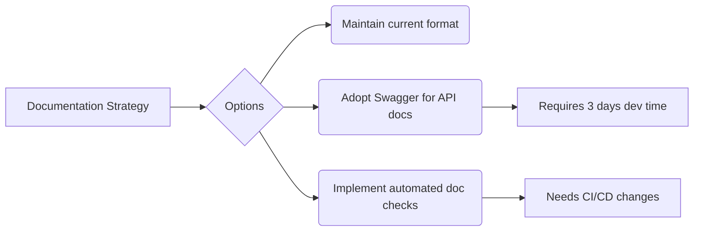

# Active Context

## Current Focus Area
Documentation compliance audit and enhancement

## Recent Changes (Last 24h)
1. User model documentation added
2. Memory Bank verification initiated
3. ProductContext.md updated with strategic goals

## Next Steps
1. Complete systemPatterns.md architecture diagrams
2. Create techContext.md with setup instructions
3. Update progress.md with current sprint goals
4. Audit all model files for documentation compliance

## Pending Decisions

## Risk Register
| Risk | Probability | Impact | Mitigation |
|------|-------------|--------|------------|
| Documentation drift | High | Medium | Daily automated checks |
| Knowledge silos | Medium | High | Cross-team review process |
| Legacy system integration | Low | Critical | Fallback API endpoints |
