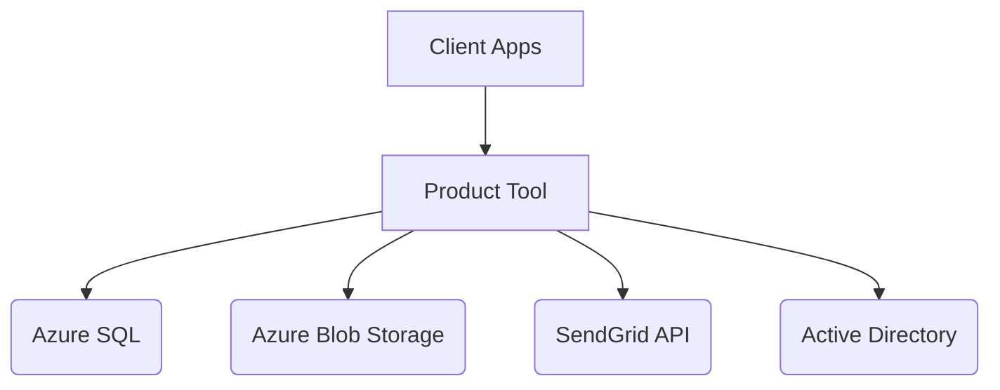

# Product Context

## Why This Project Exists
To enable secure, auditable business operations through automated product and quote lifecycle management while maintaining strict compliance with enterprise security standards.

## Core Problems Solved
1. **Data Fragmentation** - Unified system replacing 3 legacy platforms
2. **Manual Processes** - Automates quote generation/approval workflows
3. **Security Gaps** - Implements RBAC and audit trails
4. **Version Control** - Tracks product data changes over time
5. **Compliance** - Meets SOC2 and GDPR requirements

## Key Functional Requirements
| Category            | Requirements                                                                 |
|---------------------|-----------------------------------------------------------------------------|
| Authentication      | MFA support, session invalidation, password complexity enforcement         |
| Product Management  | Version history, approval workflows, CSV import/export                     |
| Quote System        | Template-driven PDF generation, client portal access, change tracking      |
| Reporting           | Audit logs, usage metrics, financial forecasting                           |
| Integration         | REST API, SMTP email services, Azure AD compatibility                      |

## Non-Functional Requirements
- **Performance**: <2s response time for 95% of requests under 500 concurrent users
- **Availability**: 99.9% uptime SLA with geo-redundant backups
- **Security**: AES-256 encryption at rest/in transit, quarterly penetration tests

## Key Dependencies

