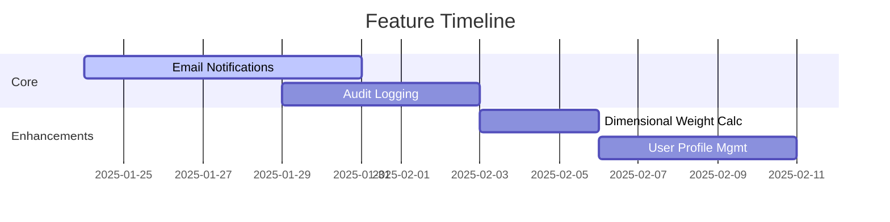

# Project Progress

## Implementation Status

| Component           | Version | Owner   | Technical Specs |
|---------------------|---------|---------|-----------------|
| Authentication      | 1.2     | Team A  | Flask-Login 0.6 + JWT |
| Product Management  | 2.1     | Team B  | SQLAlchemy 2.0 ORM |
| PDF Service         | 1.0     | Team C  | WeasyPrint 60.1 |
| Admin Dashboard     | 0.9     | Team A  | React 18 + MUI  |

## Feature Roadmap

## Security Compliance

| Category           | Requirement              | Status  | Reference               |
|--------------------|--------------------------|---------|-------------------------|
| Authentication     | MFA Implementation       | Pending | productContext.md#L23   |
| Data Protection    | AES-256 Encryption       | Partial | systemPatterns.md#L45   |
| Audit              | Change Tracking          | Draft   | RFC-8989                |
| Compliance         | GDPR Article 30          | ✔️      | techContext.md#security |

## Risk Assessment

| Risk | Severity | Mitigation Strategy | Owner |
|------|----------|---------------------|-------|
| PDF rendering latency | High | Chrome headless implementation | Team C |
| Email delivery failure | Medium | SendGrid fallback configuration | Team B |
| DB connection pooling | Critical | Azure SQL best practices | Team A |

## Documentation Checklist

- [x] API documentation (Swagger)
- [ ] Architecture diagrams
- [x] Error code reference
- [ ] Deployment runbook
- [x] Environment setup guide

## Dependencies
- SendGrid API (v3)
- Azure SQL (2019)
- Active Directory (v2.0)
