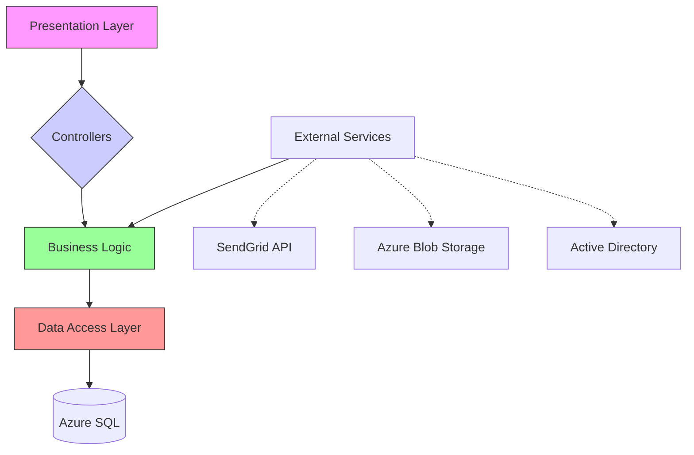

# System Architecture Patterns

## Configuration
- Uses Python-dotenv for environment management
- Hierarchical config classes (Development/Production/Testing)
- Database URI follows SQLAlchemy pattern

## Security
- Secrets stored in .env (gitignored)
- Session security settings:
  - 1h session lifetime
  - 1 week remember cookie
- Password hashing via Werkzeug security

## Services
- PDF Service:
  - Storage: instance/pdfs
  - Image processing constraints:
    - Max dimensions: 1200x800px
    - Allowed MIME types: PNG/JPEG/WEBP
    - 300 DPI resolution standard

## Data Model
- SQLAlchemy ORM with migrations via Alembic
- Core entities:
  - User (authentication)
  - Product (catalog management)
  - Quote (business logic)
  - AuditLog (security tracking)

## Templates
- Jinja2 base template inheritance
- Organized by feature area:
  - auth/ (authentication flows)
  - admin/ (administration UI)
  - products/ (catalog management)

## Core Architectural Patterns

**Key Principles**
1. Layered Architecture with strict separation
2. Dependency inversion for external services
3. CQRS pattern for product/quote operations
4. Event sourcing for audit trails

## Azure Integration
| Service          | Usage                          | Security Protocol      |
|------------------|--------------------------------|------------------------|
| Azure SQL        | Primary data store            | Managed Identity       |
| Blob Storage     | PDF templates/assets          | SAS Tokens             |
| Active Directory | RBAC enforcement              | OAuth2/OIDC            |
